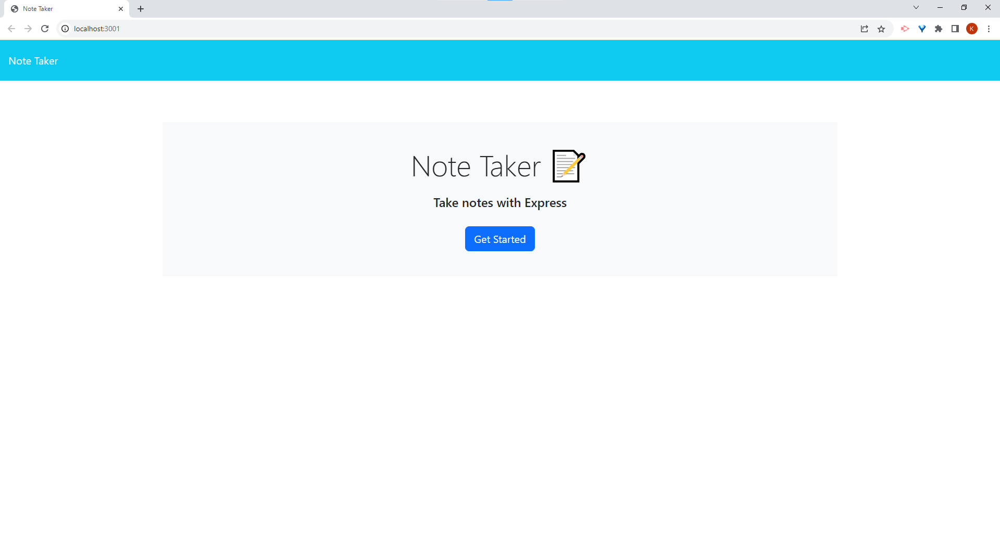

 

# **Note-Taker**  
### Created by:  
### Kevin  
_________________________
### Table of Contents
  - [Description](#description)
  - [Installation Instructions](#installation-instructions)
  - [How to use this program](#how-to-use-this-program)
  - [Contributions](#contributions)
  - [Testing](#testing)
  - [License](#license)
  - [Questions](#questions)

## **Description:**  
This project gives the user the ability to take notes and keep track of the things they need to do.  

## **Installation Instructions:**     
To use this project, copy the source code and run the server in the terminal  
  

## **How to use this program:**  
The purpose of this project is to use back-end code to create a note taking app that will make the user's life more organized  

## **Contributions:**  
please create a pull request  

## **Testing:**  
there are no tests for this project  

## **License:**  

## **Links:**  
https://github.com/KMitch137/Note-Taker
https://rocky-inlet-73531-e1ab8b037f1e.herokuapp.com/

## Questions:  
EMAIL: [kmitch137@gmail.com](mailto:kmitch137@gmail.com)  
GitHub: [KMitch137](https://github.com/KMitch137)
  